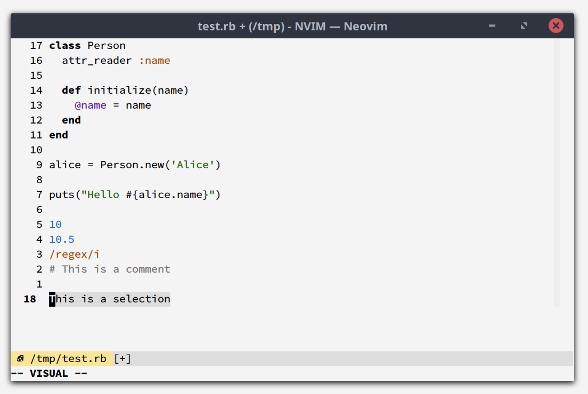
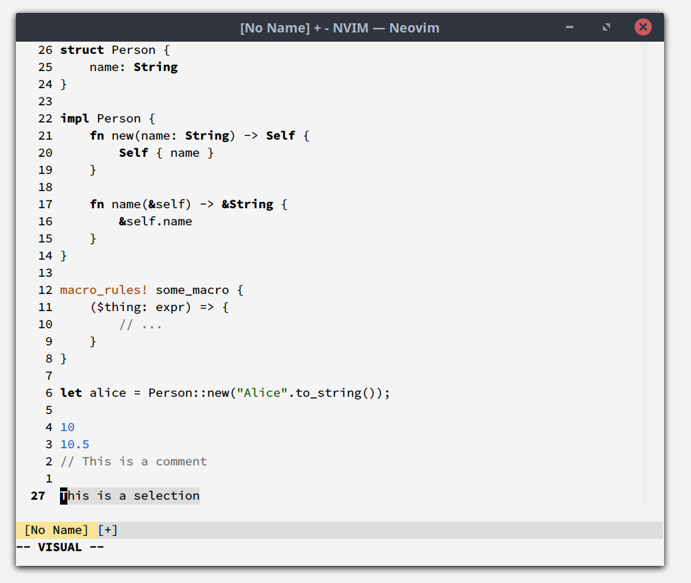
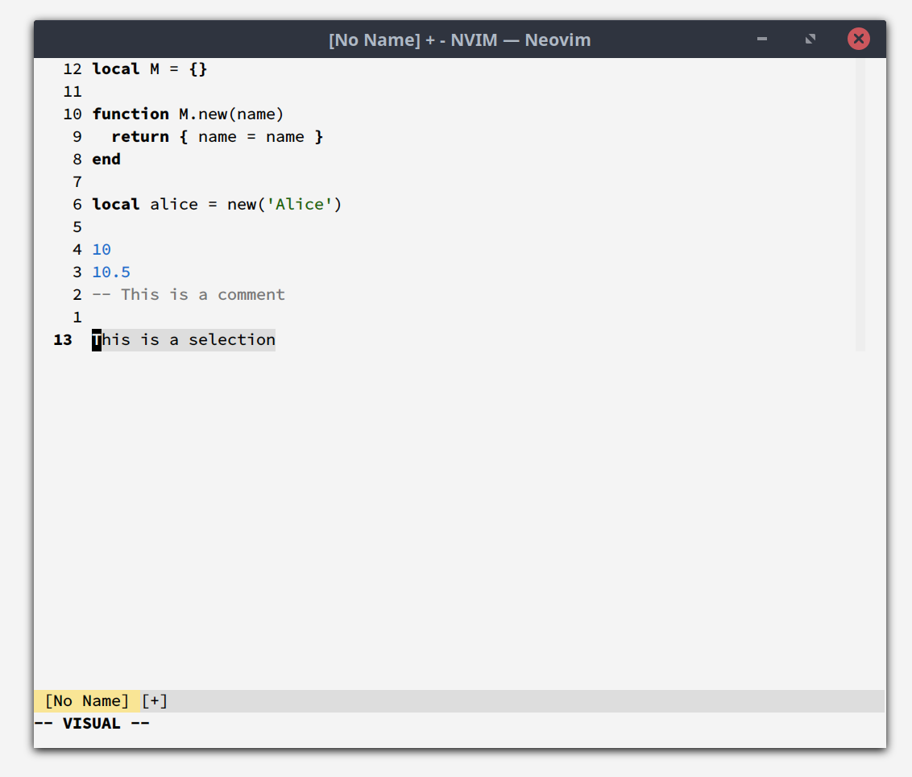
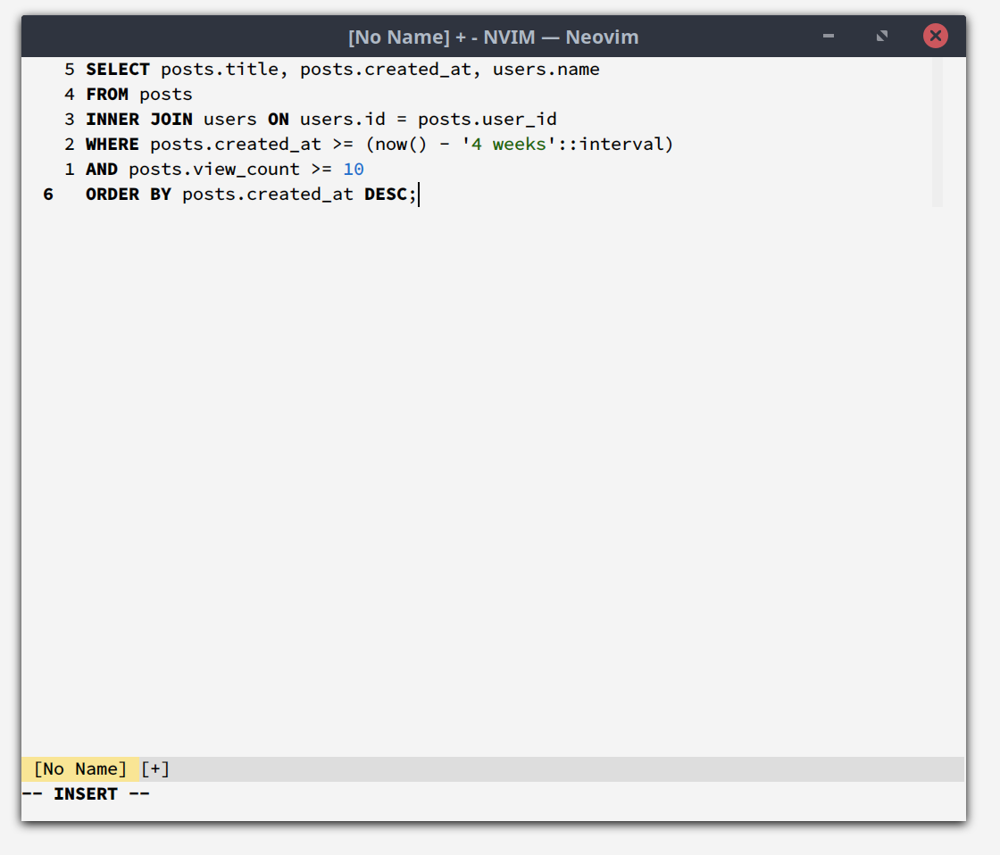

# Grey

A low-contrast theme for NeoVim, based on
[vim-paper](https://github.com/yorickpeterse/vim-paper) and written in Lua
(using `nvim_set_hl()`). Paper was the first light theme I used/created after
years of using dark themes. The rationale for that was as follows:

> I created Paper as a replacement for [Happy
> Hacking](https://github.com/yorickpeterse/happy_hacking.vim), and the
> [Autumn](https://github.com/yorickpeterse/Autumn.vim) theme it was originally
> based on. I've been using dark themes for the last decade or so, and mostly
> without issues. But dark themes are not necessarily a good choice for your eyes,
> and research has shown that it's generally better to have dark text on a light
> background (see [this StackExchange question for some interesting
> data](https://ux.stackexchange.com/questions/53264/dark-or-white-color-theme-is-better-for-the-eyes)).
> In addition, [halation](https://en.wiktionary.org/wiki/halation) becomes a
> problem when presenting light text on (very) dark backgrounds.
>
> Besides the issues with dark themes, I also simply wanted a theme with fewer
> colors; making the colors that _are_ used stand out more. I couldn't squeeze
> this into the Happy Hacking theme without fundamentally changing it, so I
> created a new theme instead.

Grey is a continuation of the goal of making a light theme that's easy on the
eyes, and not distracting by introducing many colors. The most notable
difference compared to Paper is that the main background color is a light grey,
instead of a light yellow color. Hence the (incredibly creative) name.

Like Paper, this theme is best used on a low brightness display, with a color
temperature of <5500K. During the day I use a color temperature of 5200K, while
at night the temperature is set to 3800K. This theme probably won't look so good
when using the common display temperature of 6500K.

## Screenshots

| Ruby                          | Rust                          | Lua                         | SQL                         | NeoVim Terminal
|:------------------------------|:------------------------------|:----------------------------|:----------------------------|:----------------
|  |  |  |  | 

## Requirements

* NeoVim 0.7.0 or newer (due to the use of `nvim_set_hl()`)
* true-color support

For best results use `set laststatus=3` (introduced in NeoVim 0.8), as the theme
is designed with this setting in mind.

## Installation

### Vim Plug

    Plug 'yorickpeterse/nvim-grey'

## License

All source code in this repository is licensed under the Mozilla Public License
version 2.0, unless stated otherwise. A copy of this license can be found in the
file "LICENSE".
